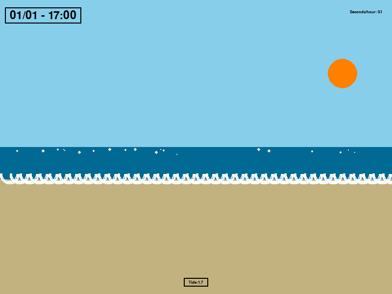

# Tide Visualize

Tide Visualize is an interactive simulation that visualizes tide changes based on data fetched from a specified URL. The application demonstrates the movement of the sun and moon, along with a beach scene that reacts to tide data. It also incorporates background music and allows user interaction to create stars on the screen.



## Features

- Fetches tide data from a specified URL and parses it.
- Animates the sun and moon based on the time of day.
- Displays tide levels visually, changing the height of the sea.
- Allows user interaction to create stars on the screen.
- Background music plays throughout the simulation.
- Adjustable speed for the time progression.

## Requirements

- Python 3.x
- Required libraries:
  - `requests`
  - `lxml`
  - `numpy`
  - `pygame`
  - `python-dotenv`

## Installation

1. Clone the repository:

   ```sh
   git clone https://github.com/Bismarck-KL/tide-visualize.git
   cd tide-visualize
    ```

2. Install the required libraries:

    ```sh
    pip install -r requirements.txt
    ```

3. Create a .env file in the project directory with the following variables:
    - URL=<your_tide_data_url>
    - YEAR=2024
    - FILENAME=page-2024.html
    - ROW_XPATH=<your_xpath_for_rows>
    - Replace <your_tide_data_url> with the URL from which to fetch tide data, and <your_xpath_for_rows> with the appropriate XPath to extract data rows.

## Running the Application

  1. Ensure you are in the project directory with the virtual environment activated.
  2. Run the application:
     ```sh
     python main.py     
  3. Use the following controls:
     - Arrow Keys: Adjust the speed of time progression.
     - Up/Down Arrow: Control the volume of the background music.
     - U key: Enable/Disable the user interface.
     - I key: Pause and unpause the background music.
     - Left Mouse Click: Create stars at the clicked location.
     - Right Mouse Click: Screen capture.
     - Escape Key: Exit the application.

## File Structure

    tide-visualize/
    ├── main.py                 # Main application file
    ├── loading_screen.py       # Loading screen file
    ├── requirements.txt        # Python dependencies
    ├── assets/                 # Asset folder
        ├── img                 # image folder
        ├── sfx                 # sound effect folder
    └── .env                    # Environment variables

## Dependencies

  Make sure to install the following dependencies using pip:
    * requests
    * lxml
    * numpy
    * pygame
    * python-dotenv

  You can install them by running:
  ```sh
  pip install requests lxml numpy pygame python-dotenv
  ```

## Sound and Background Music

The sound effects and background music used in this project are sourced from YouTube. 

If you would like to listen to or download the original tracks, please visit the following links:

- [Enviroment sound](https://www.youtube.com/watch?v=Wxs5e7RUW6k&t=5247s&ab_channel=WorldMusicCreation%E9%9F%B3%E6%A8%82%E4%B8%96%E7%95%8C)
- [Background music](https://www.youtube.com/watch?v=tKzOp1Zfahc&list=RDtKzOp1Zfahc&start_radio=1&ab_channel=dotnote)

